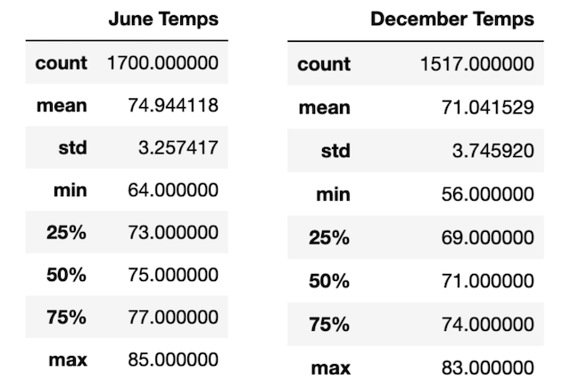

# surfs_up
SQLite｜SQLAlchemy｜Flask | Python
## Overview of the statistical analysis
The purpose of the analysis is to create a statistical analysis of the weather dataset in Oahu. The results will help determine if a surf and icecream shop business is sustaniable year-round. The analysis consists of three parts:

* Generate the summary statistics for June
* Generate the summary statistics for December
* Report the key differences in weather between June and December

## Results
After conducting the analysis, we gather the following statistics of the months of June and December.

1. June temperature had a min of 64.00, max of 85.00, and mean of 74.94.
2. December temperature had a min of 56.00, max of 83.00, and mean of 71.04. 
3. The average temperatures in June (74.94) and December (71.04) are relatively close, with about only 3-4 degrees difference, which shows the temperatures in Oahu is in comfortable range year round. 
4. The values of mean(74.9) and median(75) temperatures in June are approximately the same, which means that the data of June temperature has a symmetrical distribution. Similarly, the values of mean(71.04) and median(71.00) temperatures in December are almost identical, which means the data of December temperature also has a symmetrical distribution. 

## Summary
Based on the above statistics report, we can conclude that the temperature trends in Oahu remain steady at a confortble range (56-85) throughout the year, so running a surf shop at Oahu seems like a profitable business. 

However, to provide more insights about Oahu weather for the business planning, we could run a query on precipitation data, since precipitation is another important factor that can influence the conditions for surfing. Having a statistical summary of the precipitation in the months of June and December will help provide a better understanding of Oahu weather.

Another query we could run for a further analysis is to compare the active stations with the min, max, and mean pricipitation statistical factors. It could help determine the best location for the surf shop. 